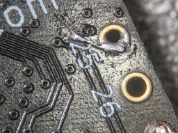
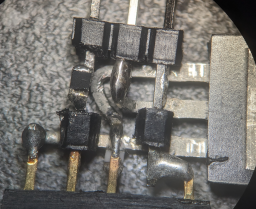

# LED hat

## Inspiration
https://www.youtube.com/watch?v=0iEVzUgQieM&t=667s

## Hardware

* **Unexpected Maker** TinyPico
  * https://unexpectedmaker.com/shop.html#!/TinyPICO/p/577111313/
* **Adafruit** Ultra Skinny NeoPixel 1515 LED Strip 4mm wide - 0.5 meter long - 75 LEDs
  * https://www.adafruit.com/product/4368
* **Adafruit** Electret Microphone Amplifier - MAX9814 with Auto Gain Control
  * https://www.adafruit.com/product/1713
* **Adafruit** Lithium Ion Polymer Battery - 3.7v 500mAh
  * https://www.adafruit.com/product/1578
* **Amazon** Baseball Cap - Plain Cap Hat Lightweight Adjustable Washed Polo Style Hat
  * https://www.amazon.co.uk/dp/B087BQ5V7Z
* **IRF5210** P-Channel MOSFET

## Previous hardware
* **DFRobot** Beetle ESP32 - C3 (RISC-V Core Development Board)
  * https://www.dfrobot.com/product-2566.html
  * Replaced with the TinyPico when I discovered in one moment that I could use DMA with the I2C peripheral to sample the mic data, and that only the original ESP32 had the relevant hardware support.  So the C3 part had to go.
* **IRF520N** N-Channel MOSFET
  * Driving the LEDs through a P-Channel device gave me high-side switching, which felt like a nice idea.

## Hardware
### TinyPico mods
1. Connecting the built-in battery monitor to a different GPIO to use a different ADC bank than the I2C peripheral

### Beetle ESP32 mods
1. Adding a potential divider to allow me to monitor the battery voltage (the TinyPico has this feature baked in)
2. Removing a resistor for a reason I forget.  (It was probably an unwanted pullup)

### LED power
1. Having fun in 3D :)

