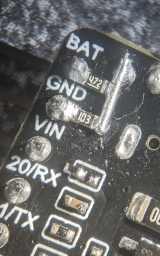

# LED hat

## Inspiration
https://www.youtube.com/watch?v=0iEVzUgQieM&t=667s

## Hardware
* **DFRobot** Beetle ESP32 - C3 (RISC-V Core Development Board)
  * https://www.dfrobot.com/product-2566.html
* **Adafruit** Ultra Skinny NeoPixel 1515 LED Strip 4mm wide - 0.5 meter long - 75 LEDs
  * https://www.adafruit.com/product/4368
* **Adafruit** Electret Microphone Amplifier - MAX9814 with Auto Gain Control
  * https://www.adafruit.com/product/1713
* **Adafruit** Lithium Ion Polymer Battery - 3.7v 500mAh
  * https://www.adafruit.com/product/1578
* IRF520N N-Channel MOSFET

### HW mods

